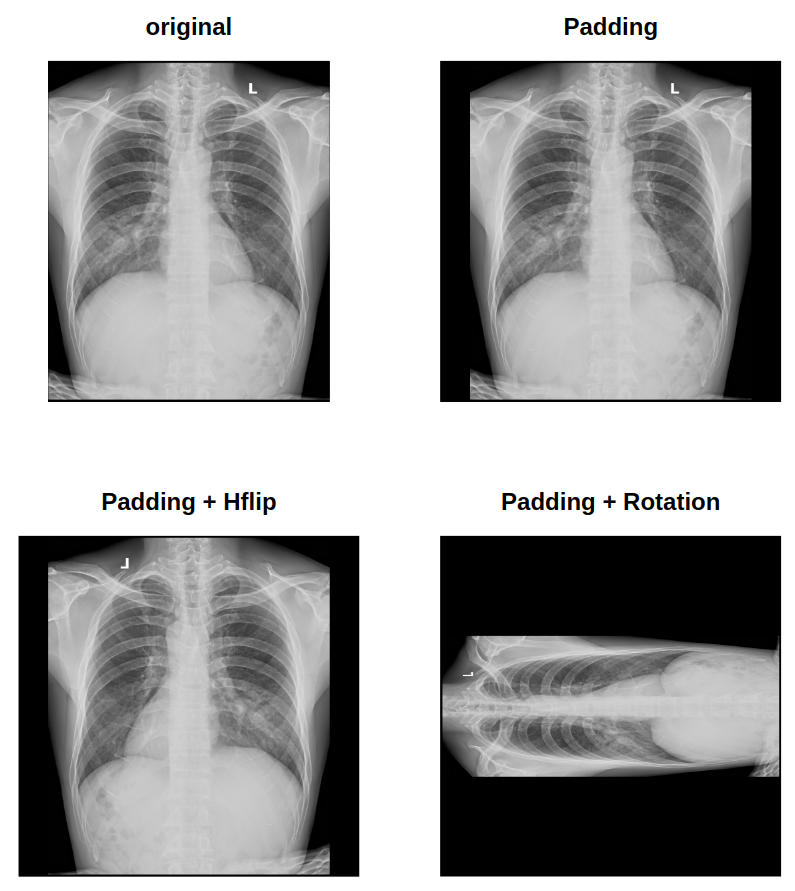
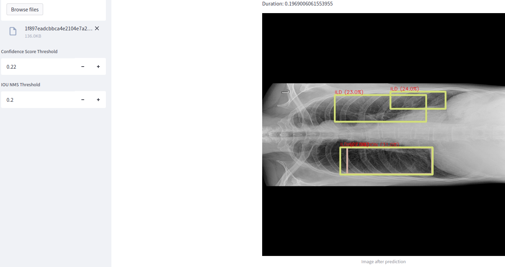

# Chest-Xray-Version2
After many experiments, we used RetinaNet and FasterR-CNN with FPN backbone, we concluded the RetinaNet is better.

**Best parameters of backbone:**
+ MODEL.FPN.OUT_CHANNELS: 256
+ MODEL.FPN.IN_FEATURES: ['res3', 'res4', 'res5']
+ MODEL.FPN.FUSE_TYPE: sum

## 14 Classes:
RetinaNet with ResNet50 in FPN backbone (3x) give us the best results in validation set after 2000 epochs. 

**Parameters of config:**
+ Augmentations: ResizeShortestEdge(short_edge_length=(640, 672, 704, 736, 768, 800),max_size=1333, sample_style='choice')
+ IMS_PER_BATCH: 1
+ BATCH_SIZE_PER_IMAGE: 64
+ WARMUP_ITERS: 100
+ BASE_LR: 0.001
+ MAX_ITER: 2000
+ STEPS_MIN: 200
+ STEPS_MAX: 1900
+ GAMMA: 0.1
+ LR_SCHEDULER_NAME: WarmupCosineLR

**Results (val):**
+ mAP@[0.5:0.95]: 0.11
+ mAP@0.5: 0.21 

## 5 Classes:
Based on the results of 14 classes, we chose 5/14 classes with model can be trainable.
+ Aortic enlargement
+ Cardiomegaly
+ ILD
+ Infiltration
+ Nodule/Mass

**Augmentation:**
5 classes are imbalance with dominance of Aortic enlargement and Cariomegaly. Therefore we apply agumentation for other 3 classes (horizontal flip + rotation with 90 degree) and padding all images with aspected ratio different 1.

Train-val-split: 80/20 (random split)

**Number of images after augmentation:**
+ Total: 4235 (train: 3472, val: 763)

**Number of annotations after augmentation:**
+ Aortic enlargement: 3071 (train: 2483, val: 588)
+ Cardiomegaly: 2239 (train: 1784, val: 455)
+ ILD: 844 (train: 716, val: 128)
+ Infiltration: 1358 (train: 1174, val: 184)
+ Nodule/Mass: 1761 (train: 1468, val: 293)

After 5000 epochs of training with Parameters of config the same in 14 classes (just changed the solver to control the learning rate schedule techquies)

**Results (train):**
+ mAP@[0.5:0.95]: 0.313
+ mAP@0.5: 0.538 

**Results (val):**
+ mAP@[0.5:0.95]: 0.305
+ mAP@0.5: 0.535 

See detail in *src-imgs/*

**Inference with UI:**

