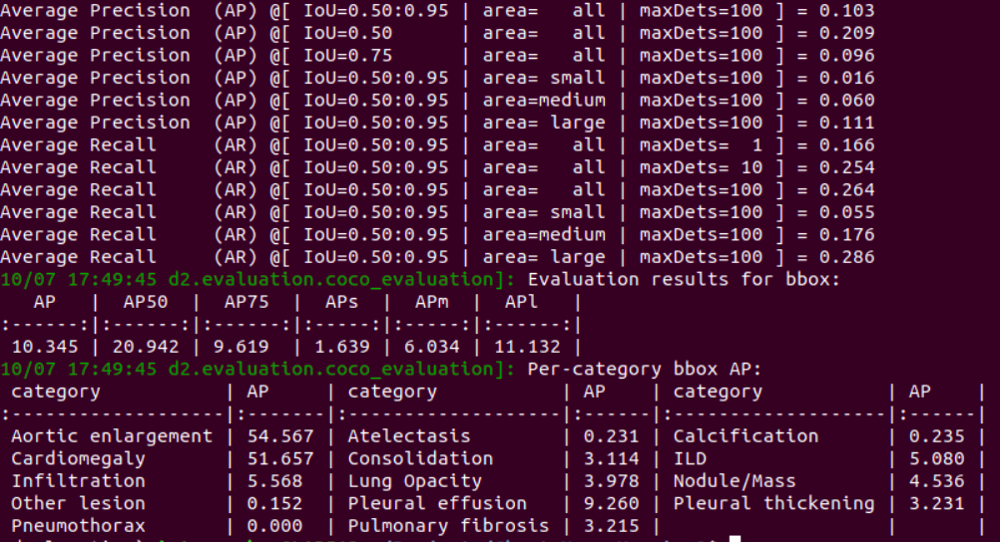

# Chest-Xray-Version2
After many experiments, we used RetinaNet and FasterR-CNN with FPN backbone, we concluded the RetinaNet is better.

Best parameters of backbone:
+ MODEL.FPN.OUT_CHANNELS: 256
+ MODEL.ROI_HEADS.IN_FEATURES: ['res4']

## 14 Classes:
RetinaNet with ResNet50 in FPN backbone (3x) give us the best results in validation set. 

