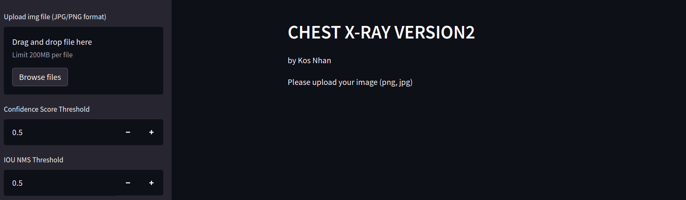
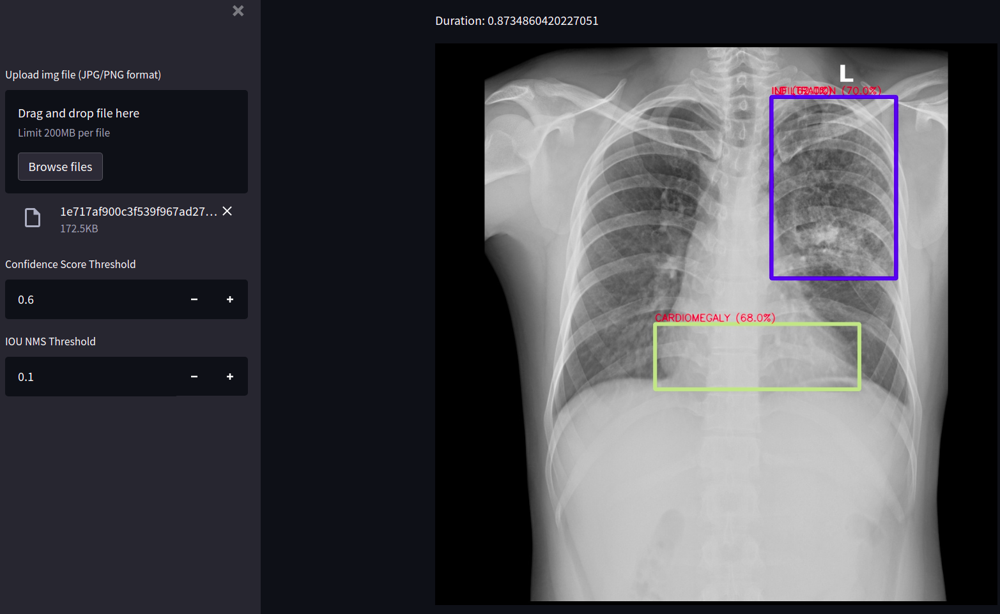
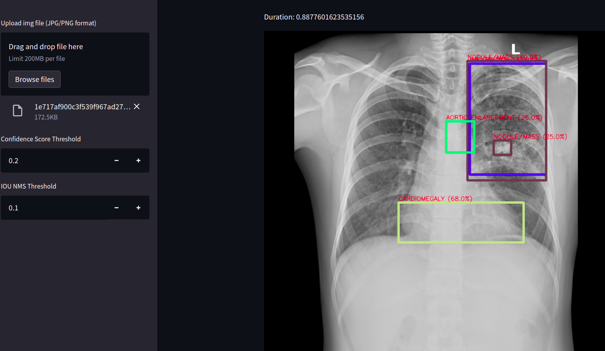
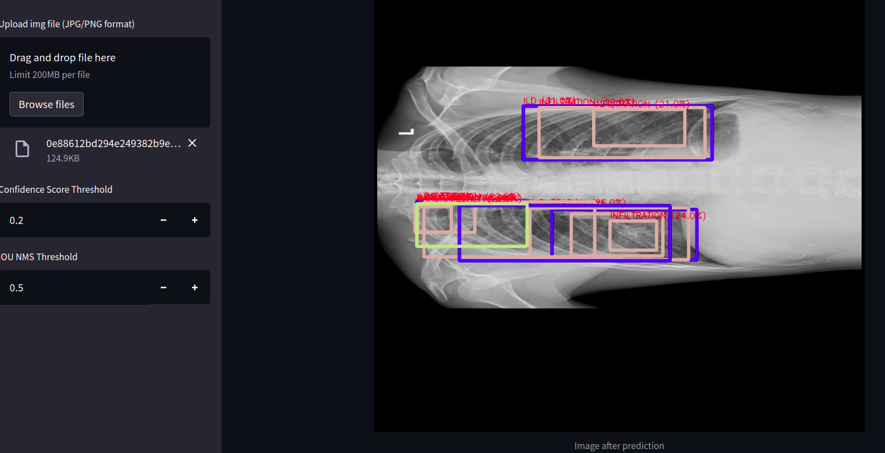
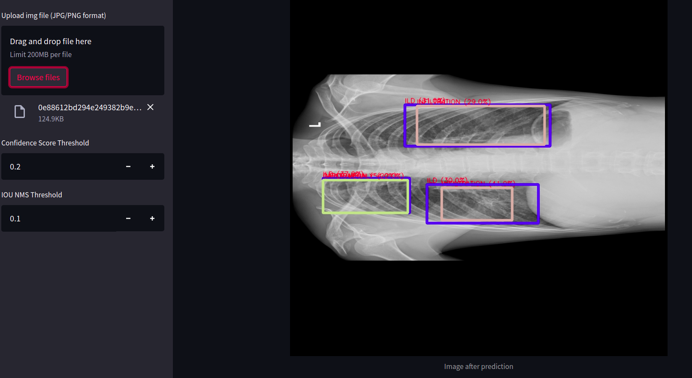

# Model-Control-Instruction-Chest-Xray-Version2

URL: [click-here](https://share.streamlit.io/datacollectorvn/chest-xray-version2-deployment/streamlit_inference.py)

## User-Interface
+ Confidence Score Threshold: The threshold to control number of bounding box predictions of model. The output only display predictions that have confidence score greater than the threshold. You can read my [explaination](https://docs.google.com/presentation/d/15F1puhvjmvTkM-ZSMjRK8IQp54zNqY7Z6h6OYKXTNgY/edit?usp=sharing)
+ IOU NMS Threshold: The Interserction of Union (IOU) in non-maximum suppression ([NMS](https://arxiv.org/pdf/1705.02950.pdf)) algorithm to control the elimination of overlapping bounding box predictions.

## Control Chest-Xray Model 
#### 1. Qualitiy and quantity trade-off:

**If you select high value of Confidence Score Threshold**, the output just display the bounding boxes predictions with high accuracy. 

**If you select low value of Confidence Score Threshold**, the output displays many the bounding boxes predictions.

#### 2. Eliminations of overlapping prediction:
**If you select high value IOU NMS Threshold**, the output display many overlapping bounding boxes predictions with the same class.

**If you select low value IOU NMS Threshold**, the output only display the bouding boxes predictions with high confidence score with the same classes.

